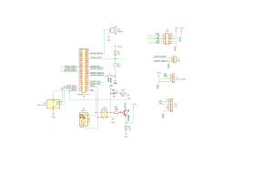

# remoteprog

Remotely program Raspberry Pi Pico and AVR microcontrollers by installing this application on a Raspberry Pi connected
to the circuit below.

## Schematic



[PDF Download](https://github.com/andrenho/remoteprog/blob/master/circuit/remote-programmer/remote-programmer.pdf)

## Usage

Install the server on the Raspberry Pi. From the PC computer, compile your program and upload it by calling the client.
It can also be used for additional functions, such as fuse programming, or SPI/I2C debugging.

```
Usage: ./remoteprog COMMAND [OPTIONS]
Commands:
  upload FILE [-c|--core=CORE] [-p|--part=PART] [--baud=BAUD] [-V|--no-verify] [-v|--verbose]
  test [-c|--core=CORE] [-p|--part=PART]
  fuse LOW HIGH EXTENDED [-p|--part=PART]
  reset [-t|--time MS]
  spi [FILE] [--baud=BAUD] [--pol=POL] [--pha=PHA] [-I|--interactive]
  i2c [FILE] [--baud=BAUD] [-z|--response-sz=COUNT] [-I|--interactive]
General options:
  -s | --server         server address (will use latest if not present)
  -d | --debug          debug mode
Cores:
  auto, pico1, pico2, avr
```

# Installation instructions

## Install client on the Computer

```shell
git clone --remote-submodules https://github.com/andrenho/remoteprog
cd remoteprog/client
make
sudo make install
```

## Install server on the Raspberry Pi

1. Install dependencies

```shell
sudo apt-get install zlib1g-dev protobuf-compiler avrdude libgpiod-dev libtool
```

2. If using to program a Pico Pi, install openocd:

```shell
git clone -b sdk-2.0.0 --recurse-submodules https://github.com/raspberrypi/openocd.git
cd openocd
./bootstrap
./configure --disable-werror --enable-bcm2835gpio
make
sudo make install
```

3. Uncomment/enable the following lines on `/boot/firmware/config.txt` (or `/boot/config.txt`):

```
dtparam=i2c_arm=on
dtparam=spi=on
```

4. Install `remoteprog` and enable service

```shell
git clone --remote-submodules https://github.com/andrenho/remoteprog
cd remoteprog/server
make
sudo make install
sudo systemctl enable remoteprog.service
```

# Additional information

## Calling the client with CMake

To automatically upload the firmware after a build, add the following to your CMakeLists.txt:

```cmake
add_custom_target(upload-remote
    COMMAND remoteprog upload ${CMAKE_PROJECT_NAME}.elf
    DEPENDS ${CMAKE_PROJECT_NAME}
    COMMENT "Uploading remotely..."
    VERBATIM
)
```

It's important to call `remoteprog` once with the `-s` option to store the correct IP server.

# Uploading directly on the Raspberry Pi

## Connecting via serial

`remoteprog` can be used as a standalone computer. Options are:

 * connect via SSH to the IP address shown on the display
 * connect a keyboard and monitor directly to the Pi
 * connect to a computer via a FTDI cable. For that, edit the file `/boot/firmware/cmdline.txt` and add the following text before
   everthing: `console=serial0,115200`. On the next reboot, the PI will start a console in the serial. Please notice
   that the UART connection cannot be used in this case.

## Uploading via SWD

This is useful when both development and uploading is being done on a Raspberry Pi. The Raspberry Pi and the Pico Pi need to be
connected on the 3-pin interface described above (SWD).

Pico Pi 1:

`sudo openocd -f interface/raspberrypi-swd.cfg -f target/rp2040.cfg -c "program my_firmware.elf verify reset exit"`

Pico Pi 2:

`sudo openocd -f interface/raspberrypi-swd.cfg -f target/rp2350.cfg -c "adapter speed 5000" -c "rp2350.dap.core1 cortex_m reset_config sysresetreq" -c "program my_firmware.elf verify; reset; exit"`

## Uploading via USB

This can be used both in the PC or the Raspberry Pi. The computer and the Pico Pi need to be connected via a USB cable.

Connect the Pico Pi with the BOOTSEL button pressed, and then run:

`./upload-usb.sh my_firmware.uf2`

(notice that for this, the **uf2** file is used instead of **elf**)
